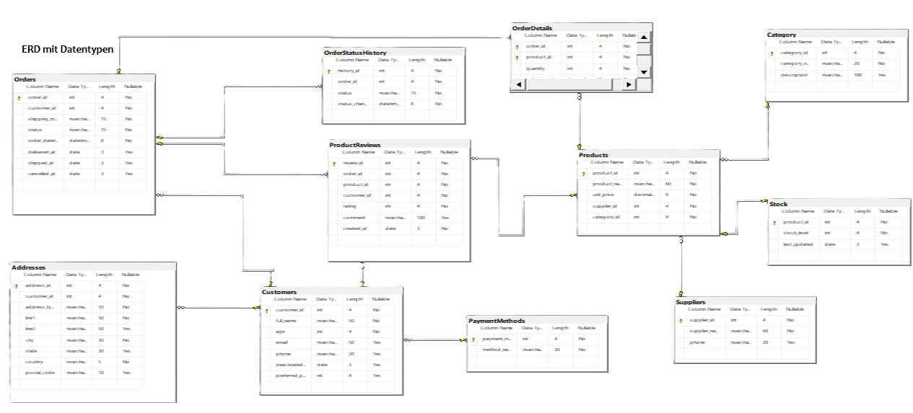
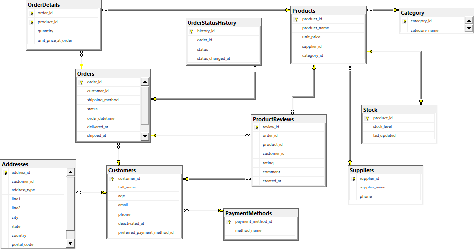

# SIO Retail Database

## Project Overview
*SIO Retail Database* is a SQL-based database system designed to manage a medium retail environment.  
It supports essential business operations such as product management, inventory tracking, orders, order status history, suppliers, customers, payment methods, product reviews, and category classification.

The database was built in SQL Server Management Studio (SSMS) and includes properly defined relationships, primary keys, foreign keys, and constraints to ensure data integrity.

---

## Features
- *Product Management*  
  Stores product details including price, quantity, category, and supplier.

- *Inventory & Stock Tracking*  
  Tracks available stock for each product and supports stock reconciliation.

- *Customer Management*  
  Stores customer details and allows linking customers to orders, addresses and reviews.

- *Order Processing*  
  Captures order details, delivery addresses, order items, order status history, and payment method used.

- *Supplier Management*  
  Stores supplier information for sourcing and restocking products.

- *Payment Methods*  
  Supports different payment types linked to customer orders.

- *Product Reviews*  
  Allows customers to rate and review products they purchased.

---

## Database Schema
The system is made up of *11 core tables* that form the foundation of the retail database.

Below is the visual representation of the database schema:

---

## Key Tables

### *Products*
Stores product details such as name, price, description, category, brand, and supplier.

### *Category*
Defines categories for grouping products.

### *Brands*
Stores product brand names.

### *Suppliers*
Contains supplier information and links to products.

### *Customers*
Stores basic customer details.

### *Orders*
Stores order-level information such as customer, order date, and delivery address.

### *OrderItems*
Stores each product included in an order.

### *OrderStatusHistory*
Tracks changes in order status over time.

### *Addresses*
Stores address information for customers and orders.

### *PaymentMethods*
Defines available payment methods.

### *ProductReviews*
Stores customer ratings and reviews for purchased products.

---

## Installation and Setup

1. *Clone the Repository*
   bash
   git clone https://github.com/Crystabel-Isioma/SIO-Retail-Database-Design-and-Implementation.git
   

2. *Open SQL Server Management Studio (SSMS)*  
   - Create a new database.  
   - Open the SQL script files from the SqlScripts/ folder.  
   - Run the scripts to create tables and relationships.

3. *Verify the Schema*  
   - Open Database Diagrams in SSMS.  
   - Ensure all tables and foreign key relationships are correctly connected.

---

## SQL Scripts
This project includes the SQL scripts used to build the entire database:

- *Table Creation Scripts*  
  Defines tables, primary keys, foreign keys, check constraints, and default values.  
  Folder: 001-Create-Scripts/

- *Views*  
  Provides summarized and analytical data through virtual tables.  
  Folder: 002-Views-Abfragen/  
  - 002-View-CustomerOrdersSummary.sql  
  - 002-View-OrderOverview.sql

- *DML Trigger*  
  Automatically restores stock quantities when an order is cancelled.  
  Folder: 003-DML-Trigger/  
  - 003-TR-RestoreStockOnCancel.sql

- *Stored Procedures*  
  Contains reusable business logic for managing orders, suppliers, and product searches.  
  Folder: 004-Procedures/  
  - 004-Procedure-CustomerOrdersSummary.sql  
  - 004-Procedure-DeleteDeliveredOrders.sql  
  - 004-Procedure-SearchProductsByName.sql  
  - 004-Procedure-UpdateSupplier.sql 

All scripts are located in the *SqlScripts* folder.

---

## Future Enhancements
Possible improvements include:

- Adding *employee/administrative roles*  
- Implementing *product restock history*  
- Adding *discounts and promotions*  
- Introducing *shopping cart* structure  
- Adding *sales reporting views*  
- Integrating *stored procedures* for common operations  

---

## License
This project is licensed under the *MIT License*.

---

## Contact
For questions or contributions, please email crystabelisiomaobiasili@gmail.com
